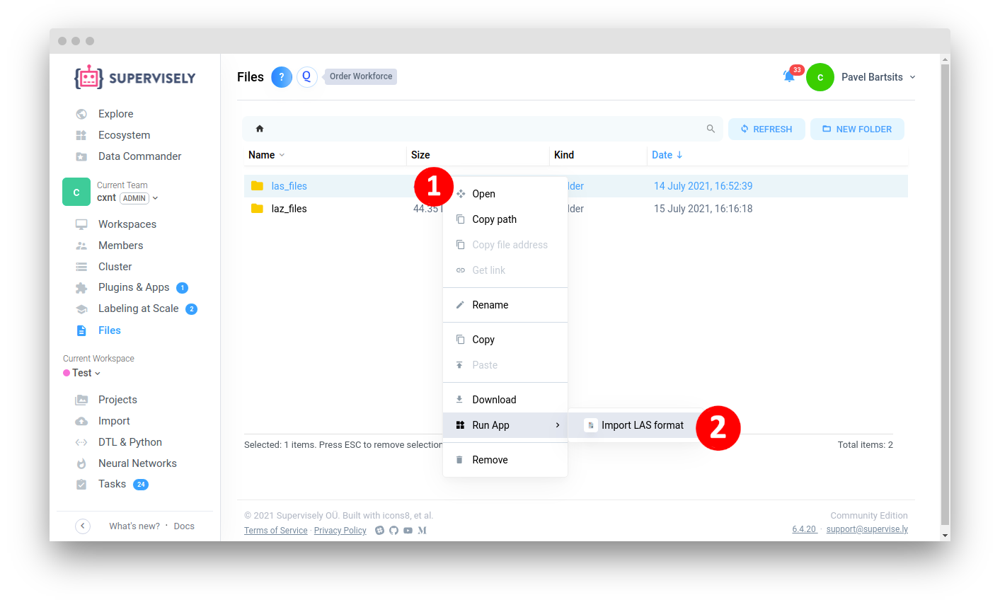
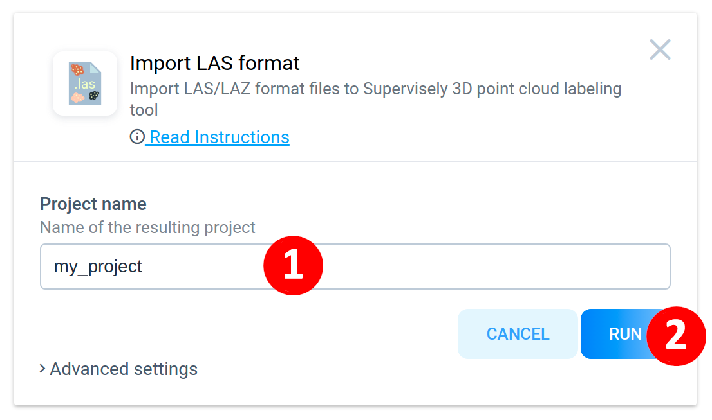
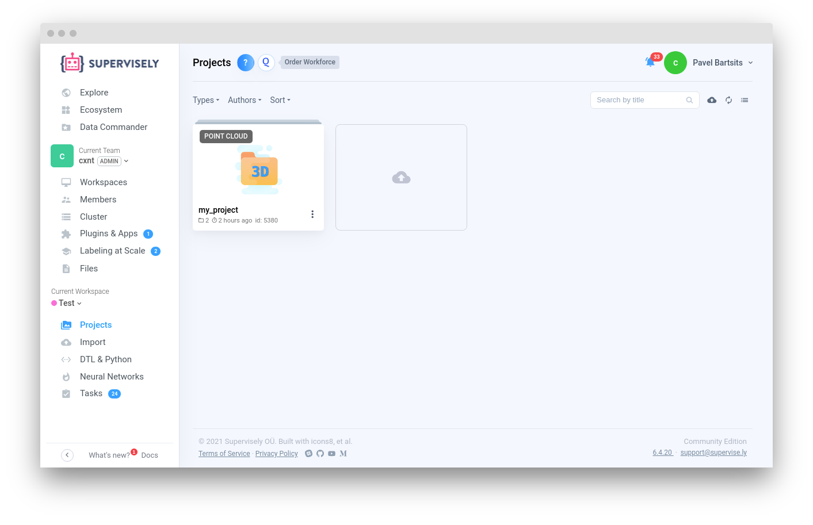

<div align="center" markdown>


# Import LAS format

<p align="center">
  <a href="#Overview">Overview</a> •
  <a href="#How-To-Run">How To Run</a> •
  <a href="#How-To-Use">How To Use</a>
</p>

  
[](https://ecosystem.supervise.ly/apps/import-las-format)
[](https://supervise.ly/slack)

[](https://supervise.ly)
[](https://supervise.ly)

</div>

## Overview

[LAS](https://www.asprs.org/divisions-committees/lidar-division/laser-las-file-format-exchange-activities) (and its compressed counterpart LAZ), is a popular format for lidar point cloud and full waveform.

File format designed for the interchange and archiving of lidar point cloud data. It is an open, binary format specified by the American Society for Photogrammetry and Remote Sensing (ASPRS). The format is widely used and regarded as an industry standard for lidar data.

🏋️ Starting from version `v1.1.0` application supports import from special directory on your local computer. It is made for Enterprise Edition customers who need to upload tens or even hundreds of gigabytes of data without using drag-ang-drop mechanism:

1. Run agent on your computer where data is stored. Watch [how-to video](https://youtu.be/aO7Zc4kTrVg).
2. Copy your data to special folder on your computer that was created by agent. Agent mounts this directory to your Supervisely instance and it becomes accessible in Team Files. Learn more [in documentation](https://docs.supervise.ly/customization/agents/agent-storage). Watch [how-to video](https://youtu.be/63Kc8Xq9H0U).
3. Go to `Team Files` -> `Supervisely Agent` and find your folder there.
4. Right click to open context menu and start app. Now app will upload data directly from your computer to the platform.

#### Structure of directory have to be the following:   
```
.
├── directory_with_las_files
    ├── file_0000001.las  # 
    ├── file_0000002.las  # Will be placed to the 1st dataset automatically
    ├── file_0000003.las  # 
    ├── las_dataset_1
    |	├── file_0000001.las
    |	├── file_0000002.las
    |	├── ...
    ├── las_dataset_2
    |	├── file_0000001.laz
    |	├── file_0000002.las
    |	├── ...
    └── ...
```
**Note:** if there are no dataset folder in the main directory, all `.las/.laz` files inside main directory will be placed into created dataset.

## How To Run 
**Step 1**: Add app to your team from [Ecosystem](https://ecosystem.supervise.ly/apps/import-las-format) if it is not there.

**Step 2**:  Go to Current Team -> `Files` page, right-click on the directory with `.las/.laz` files and choose Run App -> `Import LAS format`.



**Step 3**: Type name of the resulting project into text input and press `Run` button.



**Note:** Your project will be placed to the current workspace with selected name.



###### Image credit: https://library.carleton.ca/guides/help/lidar-formats
